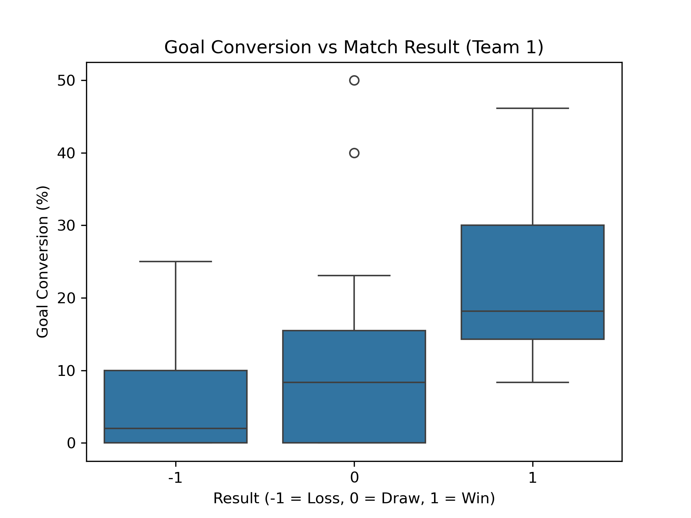
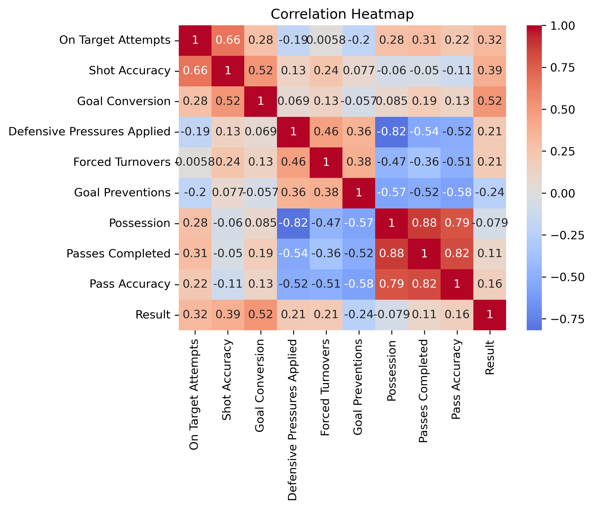
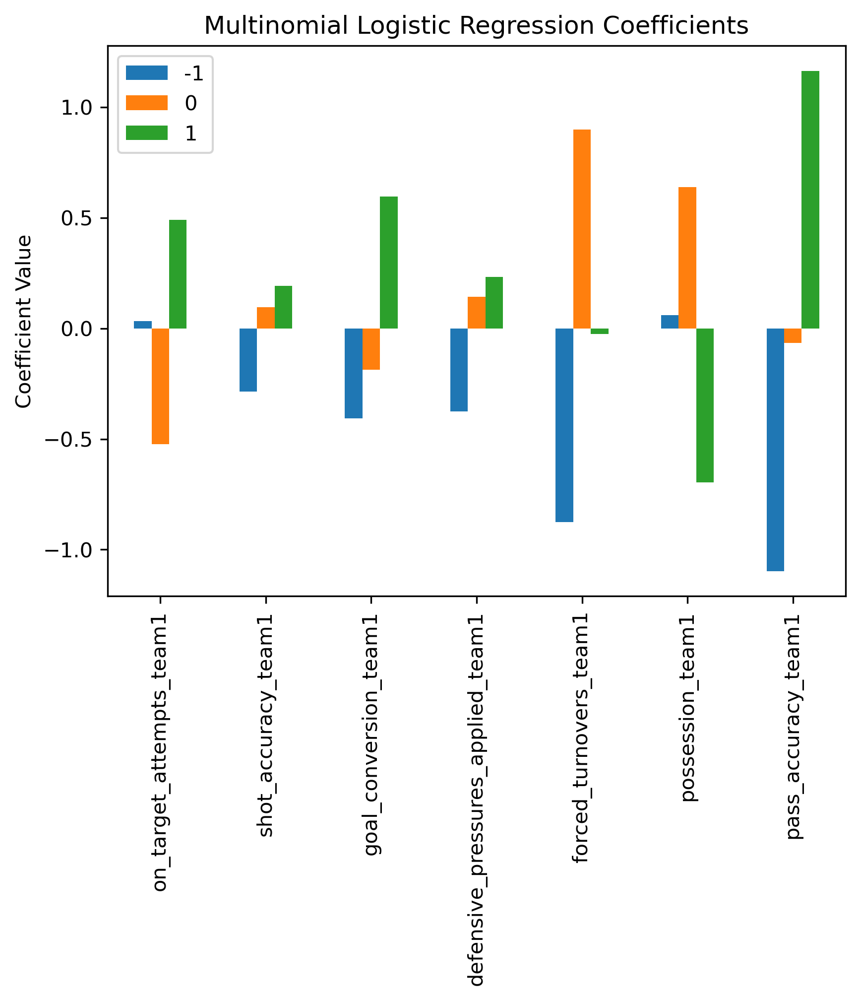

# FIFA World Cup 2022 Analysis
Exploratory data analysis and statistical modelling of FIFA World Cup 2022 match statistics.
## Project Overview
This project analyzes match statistics from the FIFA World Cup 2022 to identify which performance features are most strongly related to winning. 

The analysis includes data cleaning, exploratory data analysis (EDA), visualization, correlation analysis, and multinomial logistic regression to understand how attacking, defensive, and ball-control metrics relate to match outcomes. 

## How to Run
### For Jupyter Users

1. Clone the repository using `git clone https://github.com/AsmaaMesbah/FIFA-World-Cup-2022-Analysis.git`
2. Navigate to the folder using
   `cd FIFA-World-Cup-2022-Analysis`
4. Install dependencies using 
   `pip install -r requirements.txt`
5. Open the notebook using `jupyter notebook notebooks/fifa-world-cup-2022-match-analysis.ipynb`

### For Google Colab Users
[](https://colab.research.google.com/github/AsmaaMesbah/FIFA-World-Cup-2022-Analysis/blob/main/notebooks/fifa-world-cup-2022-match-analysis.ipynb)

## Dataset 
### Description
The dataset contains match statistics for all 64 matches of the FIFA World Cup 2022. 

Each match includes detailed performance metrics for both teams, such as the following features, which were the focus of this study: 

- total attempts
- on target attempts
- goals scored
- defensive pressures
- forced turnovers
- possession
- passes

Total matches: **64**

Total features: **88**

### Source
This dataset was retrieved from [Kaggle](https://www.kaggle.com/datasets/die9origephit/fifa-world-cup-2022-complete-dataset?resource=download) as a CSV file. 
### Preprocessing
This step included checking for missing values; none were present in this dataset. Therefore, the preprocessing step mainly included the following: 

- adding a 'result' column
- fixing broken column names
- removing the '%' sign
- converting percentage columns to numeric values

## Project Structure
The project skeleton is as follows: 
```
FIFA-World-Cup-2022-Analysis/
│
├── data/ 
│   └── Fifa_world_cup_matches.csv
│
├── notebooks/
│   └── FIFA World Cup Analysis 2022.ipynb
│
├── images/
│   └── visualizations generated from the analysis
│
├── requirements.txt
│
└── README.md
```
## Methods
The analysis includes: 

- Data cleaning & preprocessing
- Exploratory Data Analysis (EDA)
- Statistical visualization (boxplots) using seaborn and Matplotlib
- Correlation analysis between match statistics and outcomes
- Multinomial Logistic Regression to interpret feature importance

## Key Insights
Some important observations from the analysis include:

- Possession alone shows weak correlation with match outcomes.
- Attacking efficiency (shots on target relative to attempts) is strongly associated with winning.
- Defensive actions such as forced turnovers and defensive pressures show moderate influence on match outcomes.
- Match outcomes appear to depend on a combination of attacking, defensive, and ball control metrics rather than a single factor.

## Example Visualizations




## Logistic Regression Analysis 
A multinomial logistic regression model was used to interpret how different metrics influence the probability of a win, draw, or loss.

It is important to note that the dataset is small (only 64 matches), so the model here is used primarily for **interpretation rather than accurate prediction**. 

## Future Improvements
The project can be improved by: 

- using larger datasets that includes more tournaments
- training predictive models for match outcomes
- feature engineering for team strenght metrics
- applying more advanced models

# 6. References
* [Diego farchione, "Fifa World Cup 2022: Complete Dataset", Kaggle](https://www.kaggle.com/datasets/die9origephit/fifa-world-cup-2022-complete-dataset?resource=download)
* [Logistic Regression (and why it's different from Linear Regression)](https://www.youtube.com/watch?v=3bvM3NyMiE0)
* 伊藤真『Pythonで動かして学ぶ！あたらしい機械学習の教科書 第3版』翔泳社，2022年，6.1.7節
